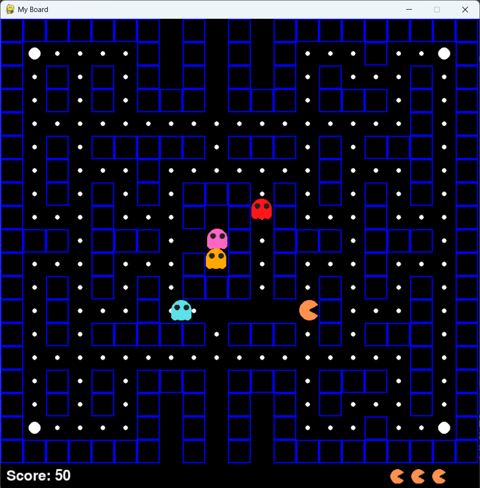

# Pac-Man Game

A classic **Pac-Man** game clone built using **Python** and **Pygame**. Navigate the maze, collect pellets, avoid ghosts, and use power-ups to turn the tables on your enemies!

---

## Features

- Player movement with arrow keys
- Multiple ghost enemies with unique AI behavior
- Pellet collection and scoring system
- Power-ups that allow Pac-Man to eat ghosts
- Lives system and game over/win conditions
- Smooth animations and collision detection
- Modular code with separate classes for Player, Ghost, and Board

---

## Controls

| Key           | Action                                  |
|---------------|----------------------------------------|
| Arrow Keys    | Move Pac-Man                            |
| Space         | Restart game after game over or win    |

---

## Gameplay

- Navigate Pac-Man through the maze to eat all pellets.
- Avoid the ghosts unless you have eaten a power-up.
- Eating a power-up allows Pac-Man to eat the ghosts for bonus points.
- Game ends when you lose all lives or clear all pellets.

---

## Screenshot

---
